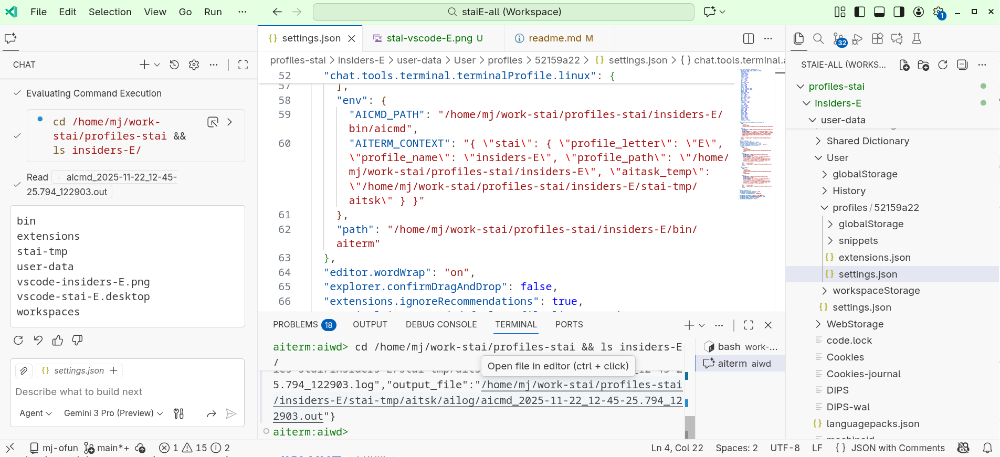

# Overview

Various [mj41's projects](https://github.com/mj41).

# VS Code Related Projects

## stai-vscode

Toolset and configuration for Visual Studio Code.

git repo: [stai-vscode](https://github.com/mj41/stai-vscode)

### cmd/vscode-bin-manager

VS Code binary manager for downloading, installing, and managing multiple VS Code insiders daily builds.

### cmd/ws-config-gen

VS Code automation and configuration tools.

Generates VS Code separate profiles and Fedora Linux desktop shortcuts:


Each has its own settings, extensions, configurations and title bar color:


### stai-vscode-userconf

User configuration templates for VS Code.
```
~/work-stai/stai-vscode-userconf [main L|✔]$ tree
.
├── common
│   ├── app-settings.json.merge.tmpl
│   ├── extensions.txt.merge.tmpl
│   └── user-settings.json.tmpl
├── insiders-B
│   └── stai-all.code-workspace.merge.tmpl
├── insiders-C
│   └── stai-all.code-workspace.merge.tmpl
├── insiders-D
│   └── stai-all.code-workspace.merge.tmpl
├── insiders-E
│   ├── stai-all.code-workspace.merge.tmpl
│   └── user-settings.json.merge.tmpl
└── readme.md
```

git repo: [stai-vscode-userconf](https://github.com/mj41/stai-vscode-userconf)

## stai-copilot

Contains VS Code Copilot configuration files in `.github` directory.

git repo: [stai-copilot](https://github.com/mj41/stai-copilot)

## stai-bins

Binaries and documentation for various tools including aicmd and aiterm.

git repo: [stai-bins](https://github.com/mj41/stai-bins)

## stai-tools

stai-bin tools source code and related utilities.

git repo: [stai-tools](https://github.com/mj41/stai-tools)

# Git Related Projects

## gl-git-links

The `gl:` git-links specification and related tools.

git repo: [gl-git-links](https://github.com/mj41/gl-git-links)

## vscode-gl-git-links

Visual Studio Code extension for `gl:` git link syntax. See `gl-git-links` repo above. Features clickable links, quick fixes, line number support, and more.

git repo: [vscode-gl-git-links](https://github.com/mj41/vscode-gl-git-links)

## gl-exA, gl-exA-src

`gl-exA` is an example repository for `gl-git-links` tools. `gl-exA-src` contains assets to programmatically generate the `gl-exA` git repository including git history.

git repos:
- [gl-exA](https://github.com/mj41/gl-exA)
- [gl-exA-src](https://github.com/mj41/gl-exA-src)

# git-rgen-tool

Tool to programmatically generate git repositories from structured assets.

git repo: [git-rgen-tool](https://github.com/mj41/git-rgen-tool)

## git-wmem

Git based utils to track uncommitted changes in multiple git repositories. Triggered by events, periodically or manually.

git repo: [git-wmem](https://github.com/mj41/git-wmem)

## git-mj-rebase

Git rebase tool.

git repo: [git-mj-rebase](https://github.com/mj41/git-mj-rebase)

## vscode-staiwatch-logger

A VS Code extension that logs workspace and file events to JSONL files for audit and analysis purposes.

git repo: later

## git-wmem-exa1

Automated tools to generate comprehensive HTML documentation of git-wmem state transitions using real git-wmem-commit binaries.

git repo: later

# IPM - Infinite Process Modeling

## ipm-drawio

Utilities for exploring the ipm text format (`.ipmt`) and converting diagrams to and from draw.io.

git repo: soon

## ipm-example-small

Demonstrate distributed logging across multiple Go modules.

git repo: soon

## ipm-fuzzy-match

A tool for matching program log entries to their source code locations using exact literal pattern matching. Takes output from `ipm-golog-refs` (metadata about log calls in source code) and program log output, then correlates log records to specific source code lines using shortest unique substring algorithms.

git repo: soon

## ipm-golog-refs

Analyzes Go source code to extract and catalog logging calls.

git repo: soon

## ipm-ptrace

Advanced ptrace-based filesystem monitoring with race-free file snapshotting for Linux (Fedora 42+).

git repo: soon

## ipm-trace-proc

Integrated `ipm-golog-refs`, `ipm-ptrace` `and ipm-fuzzy-match` tool to trace program execution and correlate log entries, ptrace events and source code lines.

git repo: soon

# Others

## mj-ofun

This repository.

git repo: [mj-ofun](https://github.com/mj41/mj-ofun)

## profiles-stai

Local directory for stai-vscode generated VS Code profiles.

### opt

Local directory for VS Code insiders binaries and extensions-cache directories.
