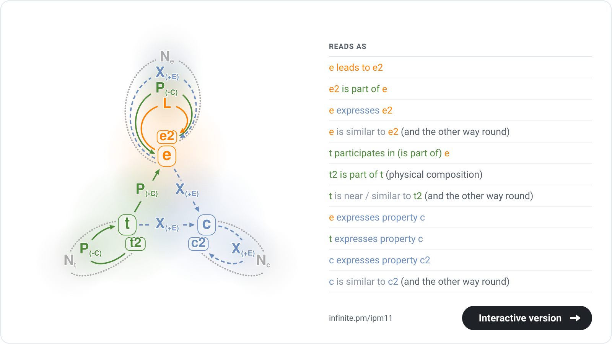
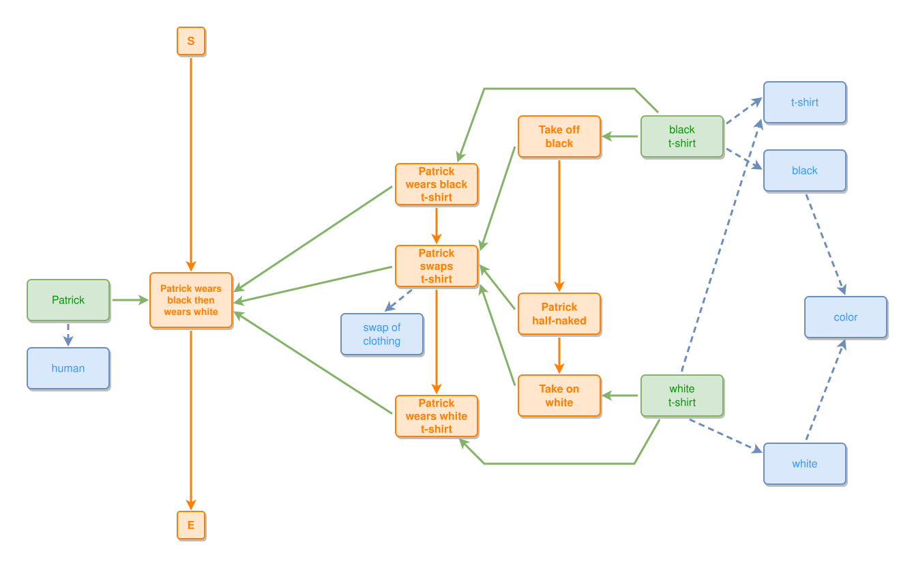
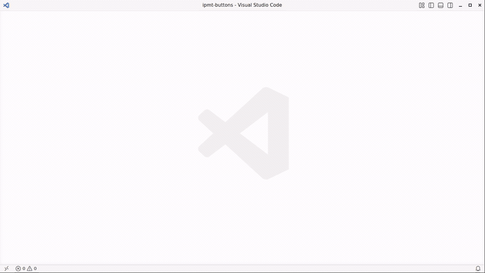
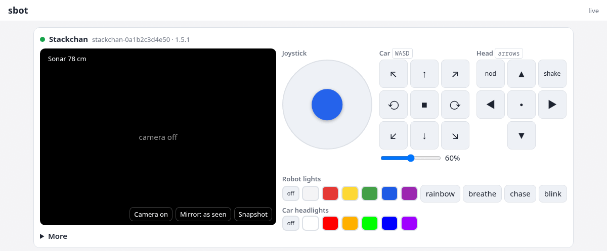
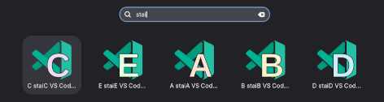
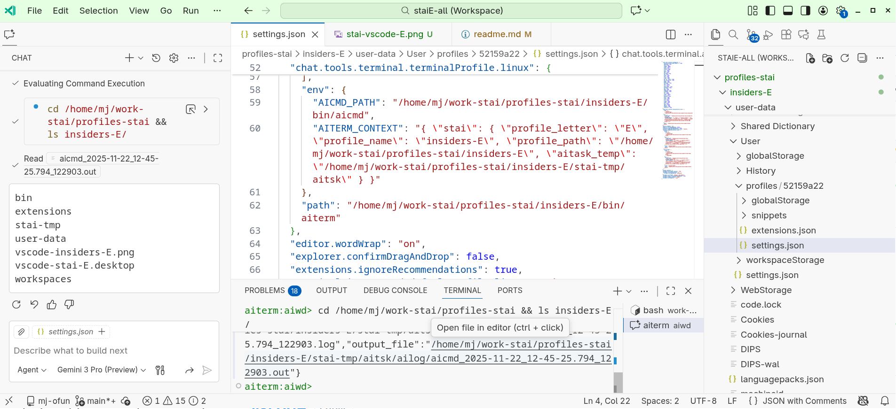
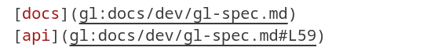
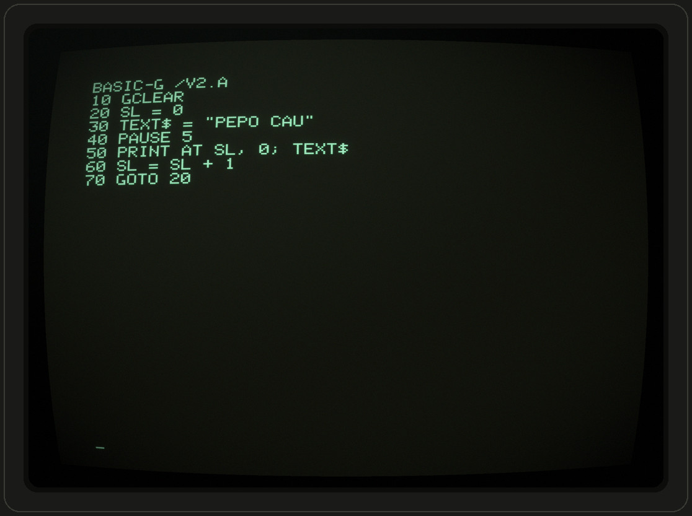

# Overview

Various [mj41's projects](https://github.com/mj41):

1. [infinite.pm: Infinite Process Modeling](#infinitepm-infinite-process-modeling)
2. [home-w42-eu: a local first home platform, with Stackchan robots](#home-w42-eu-a-local-first-home-platform-with-stackchan-robots)
3. [stai: VS Code and AI agent tooling](#stai-vs-code-and-ai-agent-tooling)
4. [Git tools](#git-tools)
5. [Minecraft](#minecraft)
6. [mj41.cz](#mj41cz)
7. [Web and infrastructure](#web-and-infrastructure)
8. [Forks](#forks)
9. [Older projects](#older-projects)

Licenses: Apache-2.0 unless noted; forks and older projects keep their own.

# infinite.pm: Infinite Process Modeling

[infinite.pm](https://infinite.pm) is a way to model processes, stories and systems as
readable graphs. It is an experiment in applying Mark Burgess's
[Semantic Spacetime γ(3,4)](https://arxiv.org/abs/2506.07756) to everyday modeling and
software engineering: three kinds of nodes (event, thing, concept) and four kinds of edges
(leads-to, part-of, expresses, near-to) are enough to sketch any observer's view of anything
in space and time. You write plain text (`ipmt`) next to your code and docs, and the tools
render the diagrams from it.

All repos live in the [infinite-pm GitHub org](https://github.com/orgs/infinite-pm/repositories).
Start with [ipm-intro](https://github.com/infinite-pm/ipm-intro), play in the
[lab](https://lab.infinite.pm).

<a href="https://infinite.pm/ipm11/maxed.html"></a>

A small model from the intro, *Patrick swaps a black t-shirt for a white one*: events lead to
events, things are part of events, and both express concepts:



## ipm-intro

A newcomer's introduction to infinite.pm, built up step by step by example: the three node
kinds, the four edge kinds, all eleven allowed edges, and worked examples.

git repo: [ipm-intro](https://github.com/infinite-pm/ipm-intro)

## ipm-tools

The Go `ipmt` toolchain: parser, validator, layout engine, SVG renderer, Markdown embedding,
and the `ipm-rpc` language server behind the VS Code extension. Also the
[ipmt syntax spec](https://github.com/infinite-pm/ipm-tools/blob/main/docs/ipmt-spec.md).

git repo: [ipm-tools](https://github.com/infinite-pm/ipm-tools)

## vscode-infinite-pm

The VS Code extension, on the
[Visual Studio Marketplace](https://marketplace.visualstudio.com/items?itemName=infinite-pm.vscode-infinite-pm):
`ipmt` highlighting, live preview, diagnostics, hover docs, and embed on save that keeps the
committed SVG diagrams in sync with their source.



git repos:
- [vscode-infinite-pm](https://github.com/infinite-pm/vscode-infinite-pm): the extension
- [vscode-infinite-pm-demo](https://github.com/infinite-pm/vscode-infinite-pm-demo): recordings
  of what it does, with step by step stills
- [vscode-infinite-pm-dev](https://github.com/infinite-pm/vscode-infinite-pm-dev): the tooling
  that records them, real VS Code driven by Playwright in a container

## infinite-pm-web, infinite-pm-lab, semantic-st-web

The websites: [infinite.pm](https://infinite.pm), [lab.infinite.pm](https://lab.infinite.pm)
for experimental results, POCs and sandcastles, and [semantic.st](https://semantic.st), a list
of links about Semantic Spacetime.

git repos:
- [infinite-pm-web](https://github.com/infinite-pm/infinite-pm-web)
- [infinite-pm-lab](https://github.com/infinite-pm/infinite-pm-lab)
- [semantic-st-web](https://github.com/infinite-pm/semantic-st-web)

## Early experiments

Tools that trace a program's run and match its log lines, ptrace events and source code
lines. Not public.

- **ipm-golog-refs**: analyzes Go source code to extract and catalog logging calls.
- **ipm-fuzzy-match**: matches program log entries to their source code locations, using
  `ipm-golog-refs` output and shortest unique substrings.
- **ipm-ptrace**: ptrace-based filesystem monitoring with race-free file snapshotting for
  Linux (Fedora 42+).
- **ipm-trace-proc**: the three above integrated: traces a program's execution and correlates
  log entries, ptrace events and source code lines.
- **ipm-example-small**: distributed logging across multiple Go modules, as an example.
- **ipm-drawio**: explores the `ipmt` format and converts diagrams to and from draw.io.

The first "coming soon" page of infinite.pm, now replaced by infinite-pm-web:
[ipm-web](https://github.com/mj41/ipm-web).

# home-w42-eu: a local first home platform, with Stackchan robots

A **local first, security and privacy first platform for a home**: Go servers on a small
machine at home, every device (new or old) a light client of them, and loops that AI
helps you write and you approve. The first devices are M5Stack Stackchan robots and a
micro:bit car. All proofs of concept, vibe coded, not reviewed by humans yet. Licenses: MIT for the
Stackchan firmware fork (as upstream) and s-w42-eu-raw, s-w42-eu-pet and s-w42-eu-manager,
Apache-2.0 for the rest.

Overview page: [s.w42.eu](https://s.w42.eu). Live on w42.eu: [sm.w42.eu](https://sm.w42.eu) (set a
robot up, its apps), [raw.sa.w42.eu](https://raw.sa.w42.eu) (every raw sensor),
[pet.sa.w42.eu](https://pet.sa.w42.eu) (the pet), [focus.sa.w42.eu](https://focus.sa.w42.eu) (the
focus timer).

**The robot is a body; the app lives on a server.** Point the robot at another server and the
same robot becomes a pet for kids, a dashboard with every raw sensor, or a cockpit that drives
a car:


| Pet for kids ([s-w42-eu-pet](https://github.com/mj41/s-w42-eu-pet)) | Every raw sensor ([s-w42-eu-raw](https://github.com/mj41/s-w42-eu-raw)) | Robot + car ([s-w42-eu-sbot](https://github.com/mj41/s-w42-eu-sbot)) |
|---|---|---|
|  |  |  |

## home-w42-eu

Vision, use cases (the main driver), principles, architecture and the device wire protocol.

git repo: [home-w42-eu](https://github.com/mj41/home-w42-eu)

license: Apache-2.0

## home-w42-eu-ideas

Ideas for devices, adapters and loops: old phones, a Roomba, Home Assistant, a private GPS
app, cameras, Wi-Fi presence, calendars, personal captures, local voice.

git repo: [home-w42-eu-ideas](https://github.com/mj41/home-w42-eu-ideas)

license: Apache-2.0

## StackChan firmware: Embody Mode

Fork of [m5stack/StackChan](https://github.com/m5stack/StackChan) with the Embody Mode app:
the robot as a light client of a server you choose (camera, microphone, speaker, every
sensor as raw data, commands), switchable between servers and apps. Optional: it drives a
TPBot car over BLE, and servers can automate it. Setup guide:
[SETUP.md](https://github.com/mj41/StackChan/blob/embody-mj41/firmware/main/apps/app_embody_mode/SETUP.md).

git repo: [StackChan, branch embody-mj41](https://github.com/mj41/StackChan/tree/embody-mj41)

license: MIT (the firmware, as upstream)

## s-w42-eu-manager

The Stackchan manager (Go), optional: sets robots up with one click over USB (firmware, apps,
Wi-Fi), gives each robot its own token for each app, keeps a live connection to its robots
(switch apps, restart, change apps from the page), and signs people in once for every app. At
home on your own computer, or online at [sm.w42.eu](https://sm.w42.eu); a home manager may link
up to it.

git repo: [s-w42-eu-manager](https://github.com/mj41/s-w42-eu-manager)

license: MIT

## s-w42-eu-raw

Relay and dashboard for Stackchan robots in Embody Mode (Go, single binary), and the Go
implementation of the wire protocol. The robot connects out over WebSocket, and a phone
pairs by scanning the QR code on the robot's screen. The phone then gets a live dashboard:
camera, microphone, speaker, head motion, face, LEDs, every sensor, IR, NFC, files; end to end
encrypted, so the server relays only ciphertext.

git repo: [s-w42-eu-raw](https://github.com/mj41/s-w42-eu-raw)

license: MIT

## s-w42-eu-pet

A Tamagotchi for Stackchan (Go), a second Embody Mode server the robot switches to. Kids
care for the pet on the robot itself (head touches, NFC food cards, menus on the screen) and
on a picture page on a phone. Games, a photo leaderboard, and a parent page with the daily
routine behind a PIN. Czech and English.

git repo: [s-w42-eu-pet](https://github.com/mj41/s-w42-eu-pet)

license: MIT

## s-w42-eu-focus

Focus, a focus timer for Stackchan in the style of the Pomodoro Technique® (Go), an Embody Mode
app the robot switches to. The robot is the timer: the time left as a ring and on its LEDs, a
chime and a nod when a phase ends, "FREE IN 12 MIN" for the room; tap to start or pause, hold to
skip. A phone paired by the QR code adds the task, interruption marks, statistics and settings.

git repo: [s-w42-eu-focus](https://github.com/mj41/s-w42-eu-focus)

license: Apache-2.0

## s-w42-eu-sbot

The seed of the home node: a web/API server with a cockpit for a Stackchan and a TPBot car
(camera, joystick, head pad, lights, a sonar safety stop), an event hub (NATS JetStream),
and a controller server for loops.

git repo: [s-w42-eu-sbot](https://github.com/mj41/s-w42-eu-sbot)

license: Apache-2.0

## tpbot-ble

micro:bit V2 firmware (TinyGo) for the ELECFREAKS TPBot car: a BLE peripheral with raw
sensors and a watchdog, plus a laptop tool and a bridge.

git repo: [tpbot-ble](https://github.com/mj41/tpbot-ble)

license: Apache-2.0

## ha-modbus-windows-shutter

Older, before home-w42-eu: Python scripts that connect a Waveshare Modbus RTU Relay 32CH to
Home Assistant to control window shutters.

git repo: [ha-modbus-windows-shutter](https://github.com/mj41/ha-modbus-windows-shutter)

# stai: VS Code and AI agent tooling

## stai-vscode

Toolset and configuration for Visual Studio Code.

git repo: stai-vscode (private for now)

### cmd/vscode-bin-manager

VS Code binary manager for downloading, installing, and managing multiple VS Code insiders daily builds.

### cmd/ws-config-gen

VS Code automation and configuration tools.

Generates VS Code separate profiles and Fedora Linux desktop shortcuts:


Each has its own settings, extensions, configurations and title bar color:


## stai-vscode-userconf

User configuration templates for VS Code.
```
~/work-stai/stai-vscode-userconf [main L|✔]$ tree
.
├── common
│   ├── app-settings.json.merge.tmpl
│   ├── extensions.txt.merge.tmpl
│   └── user-settings.json.tmpl
├── insiders-B
│   └── stai-all.code-workspace.merge.tmpl
├── insiders-C
│   └── stai-all.code-workspace.merge.tmpl
├── insiders-D
│   └── stai-all.code-workspace.merge.tmpl
├── insiders-E
│   ├── stai-all.code-workspace.merge.tmpl
│   └── user-settings.json.merge.tmpl
└── readme.md
```

git repo: [stai-vscode-userconf](https://github.com/mj41/stai-vscode-userconf)

## stai-copilot

AGENTS.md and other files for AI agents; VS Code Copilot configuration in the `.github`
directory.

git repo: [stai-copilot](https://github.com/mj41/stai-copilot)

## stai-bins

Binaries and documentation for various tools including aicmd and aiterm.

git repo: [stai-bins](https://github.com/mj41/stai-bins)

## stai-tools

stai-bin tools source code and related utilities.

git repo: [stai-tools](https://github.com/mj41/stai-tools)

## vscode-staiwatch-logger

A VS Code extension that logs workspace and file events to JSONL files for audit and analysis purposes.

git repo: later

# Git tools

## gl-git-links

The `gl:` git-links specification and related tools.

git repo: [gl-git-links](https://github.com/mj41/gl-git-links)

## vscode-gl-git-links

Visual Studio Code extension for `gl:` git link syntax. See `gl-git-links` repo above. Features clickable links, quick fixes, line number support, and more.



git repo: [vscode-gl-git-links](https://github.com/mj41/vscode-gl-git-links)

## gl-exA, gl-exA-src

`gl-exA` is an example repository for `gl-git-links` tools. `gl-exA-src` contains assets to programmatically generate the `gl-exA` git repository including git history.

git repos:
- [gl-exA](https://github.com/mj41/gl-exA)
- [gl-exA-src](https://github.com/mj41/gl-exA-src)

## git-rgen-tool

Tool to programmatically generate git repositories from structured assets.

git repo: [git-rgen-tool](https://github.com/mj41/git-rgen-tool)

## git-wmem

Git based utils to track uncommitted changes in multiple git repositories. Triggered by events, periodically or manually.

git repo: [git-wmem](https://github.com/mj41/git-wmem)

## git-wmem-exa1

Automated tools to generate comprehensive HTML documentation of git-wmem state transitions using real git-wmem-commit binaries.

git repo: later

## git-mj-rebase

Git rebase tool.

git repo: [git-mj-rebase](https://github.com/mj41/git-mj-rebase)

# Minecraft

The server runs at [mc.w42.eu](https://mc.w42.eu). All Minecraft projects, including the
private ones behind the server: [mj-ofun-mc](https://github.com/mj41/mj-ofun-mc).

## mc26, go-mc26, go-mc26-kit

A Go library for Minecraft: Java Edition 26.x, generated from Mojang's unobfuscated server
jars: the network protocol, game data and world formats as Go types, one branch per Minecraft
version. `mc26` extracts JSON from the jar and generates the library; `go-mc26-kit` adds a
client, a server framework, account flows and examples, tested against every build.

git repos:
- [mc26](https://github.com/mj41/mc26): the extractors, generators and pipeline
- [go-mc26](https://github.com/mj41/go-mc26): the generated library
- [go-mc26-kit](https://github.com/mj41/go-mc26-kit): bot, server framework, accounts, examples
- [mc26-data](https://github.com/mj41/mc26-data): the game data and wire schema of every
  release as JSON, with Markdown docs
- [mc26-data-pre](https://github.com/mj41/mc26-data-pre): the same for snapshots and pre-releases

license: MIT (go-mc26 carries code from [Tnze/go-mc](https://github.com/Tnze/go-mc))

## minecraft-fedora-installer

Per-user Minecraft launcher installer for Fedora Linux (Go). Downloads the official launcher, installs it into XDG locations, and creates a desktop entry with automatic GPU detection.

git repo: [minecraft-fedora-installer](https://github.com/mj41/minecraft-fedora-installer)

# mj41.cz

[mj41.cz](https://mj41.cz): a single hand-written page, no build step. It shows one of my
first programs, written in a school notebook in 1991/92 when I was 11, in BASIC-G for the
PMD 85, a Czechoslovak 8-bit computer. The green screens are not drawn: a container builds
[GPMD85Emulator](https://github.com/mborik/GPMD85Emulator), boots a PMD 85-2A with the
BASIC-G V2.A ROM module, and types the program in one key at a time. A script then turns the
captured bitmap into something that looks like a photo of the monitor. Details:
[tools/pmd85-emulator](https://github.com/mj41/mj41.github.io/blob/main/tools/pmd85-emulator/README.md).



git repo: [mj41.github.io](https://github.com/mj41/mj41.github.io)

# Web and infrastructure

## w42-eu-web

The [w42.eu](https://w42.eu) landing page, [s.w42.eu](https://s.w42.eu) (the Stackchan
projects) and [mcbot.w42.eu](https://mcbot.w42.eu): one Go binary with the pages embedded.

git repo: [w42-eu-web](https://github.com/mj41/w42-eu-web)

## go-redir-svc

A lightweight Go service for domain redirects, with JSONL logging per group of domains and
one certificate per group.

git repo: [go-redir-svc](https://github.com/mj41/go-redir-svc)

## go-test-web

A simple Go web server for Kubernetes that serves a test page.

git repo: [go-test-web](https://github.com/mj41/go-test-web)

# Forks

- [StackChan](https://github.com/mj41/StackChan): Embody Mode on branch `embody-mj41`, see
  [above](#stackchan-firmware-embody-mode).
- [go-mc](https://github.com/mj41/go-mc): branch `mj-262-cubes` supports Minecraft 26.2
  (protocol 776); `mj-121-cubes` is the frozen 1.21.11 line.
- [SSTorytime](https://github.com/mj41/SSTorytime): Mark Burgess's Semantic Spacetime story
  graph database.
- [ipm-intro](https://github.com/mj41/ipm-intro): my fork of infinite-pm/ipm-intro.
- [vscode](https://github.com/mj41/vscode),
  [vscode-github-markdown-preview](https://github.com/mj41/vscode-github-markdown-preview),
  [cert-manager-webhook-linode](https://github.com/mj41/cert-manager-webhook-linode).

# Older projects

Perl and Raku (Perl 6), 2010–2022:

- Presentations: [git-course-mj41](https://github.com/mj41/git-course-mj41),
  [perl6-history-mj41](https://github.com/mj41/perl6-history-mj41),
  [perl-myths-busters](https://github.com/mj41/perl-myths-busters),
  [Presentation-Builder](https://github.com/mj41/Presentation-Builder),
  [prbuilder-docker](https://github.com/mj41/prbuilder-docker)
- Git analytics: [Git-Analytics](https://github.com/mj41/Git-Analytics),
  [Git-ClonesManager](https://github.com/mj41/Git-ClonesManager),
  [Git-Repository-LogRaw](https://github.com/mj41/Git-Repository-LogRaw),
  [git-trepo](https://github.com/mj41/git-trepo),
  [git-trepo-gen](https://github.com/mj41/git-trepo-gen)
- Raku: [Perl6-Analytics](https://github.com/mj41/Perl6-Analytics),
  [Perl6-Analytics-results](https://github.com/mj41/Perl6-Analytics-results),
  [Perl-6-GD](https://github.com/mj41/Perl-6-GD),
  [Raku-StepByStep](https://github.com/mj41/Raku-StepByStep),
  [Algorithm-SpiralMatrix](https://github.com/mj41/Algorithm-SpiralMatrix),
  [SP6](https://github.com/mj41/SP6),
  [docker-perl6-star](https://github.com/mj41/docker-perl6-star)
- Google AI Challenge bots: [AIAnts](https://github.com/mj41/AIAnts),
  [MyTronBot](https://github.com/mj41/MyTronBot)
- Utilities: [auto-unrar](https://github.com/mj41/auto-unrar),
  [backup-mj41cz](https://github.com/mj41/backup-mj41cz),
  [fancontrol](https://github.com/mj41/fancontrol),
  [perl-inotify](https://github.com/mj41/perl-inotify),
  [threading](https://github.com/mj41/threading),
  [BrnoPM-Web](https://github.com/mj41/BrnoPM-Web),
  [www-gooddata](https://github.com/mj41/www-gooddata) (fork)

# This repo and local directories

## mj-ofun

This repository.

git repo: [mj-ofun](https://github.com/mj41/mj-ofun)

## profiles-stai

Local directory for stai-vscode generated VS Code profiles.

### opt

Local directory for VS Code insiders binaries and extensions-cache directories.
